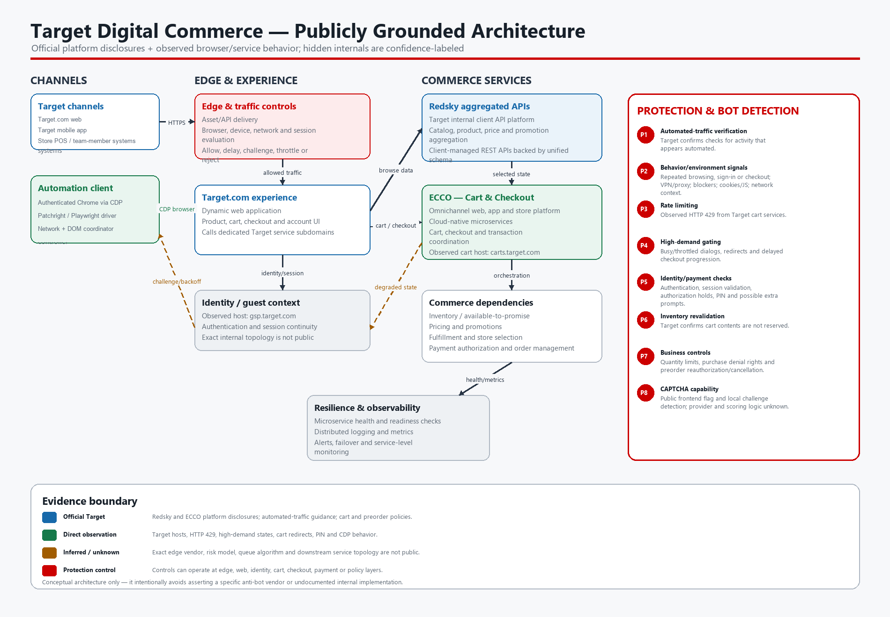

# Target Digital Commerce Architecture and Protection Model

Date: 2026-09-18



## Purpose and evidence boundary

This document describes Target’s digital commerce system as far as it can be reconstructed from:

1. Target’s own engineering publications.
2. Target’s current help and policy pages.
3. Publicly observable Target web hosts and frontend configuration.
4. The preserved Target product/cart/checkout runs in this repository.
5. Public open-source clients that consume Target’s Redsky APIs.

This is not Target internal documentation. Service boundaries below are classified as:

- **Official:** directly described by Target.
- **Observed:** visible in Target browser traffic, page source, or preserved runs.
- **Inferred:** a necessary conceptual dependency whose exact implementation is not public.
- **Unverified:** a third-party claim that lacks sufficient Target-specific evidence.

## Executive architecture summary

Target’s publicly documented commerce architecture has two major platforms:

- **Redsky:** an aggregated API platform used by Target web and application teams for product, price, promotion, and related browse data.
- **ECCO — Enterprise Cart & Checkout:** the cloud-native microservices platform that powers transactions across Target.com, the Target mobile app, and Target stores.

The Target.com experience sits in front of those platforms. Its public frontend configuration references dedicated Target service subdomains that can be mapped conceptually to browse, identity, orchestration, and cart functions. The model includes an edge and automated-traffic protection layer because Target confirms automatic guest verification and the preserved runs observed challenges, throttling, and rejected requests.

Target serves PerimeterX (HUMAN Security) challenges on at least `redsky.target.com`, confirmed by direct probe. The scoring model, checkout queue algorithm, fraud system, inventory reservation implementation, and downstream order-service topology remain non-public.

## Publicly grounded service map

| Layer | Component | Responsibility | Evidence | Confidence |
|---|---|---|---|---|
| Channels | Target.com, Target app, store systems | Customer and team-member shopping channels | ECCO article states all transactions across web, app, and nearly 2,000 stores flow through ECCO | Official |
| Edge | Traffic delivery and automated-traffic controls | Deliver assets/APIs; evaluate browser, device, network, and repeated traffic behavior | Target automated-traffic help; observable challenge/error states | Official function; internal design unknown |
| Web experience | Target.com dynamic application | Product, cart, checkout, account, and order-confirmation UI | Current Target HTML and preserved browser runs | Observed |
| Identity | Guest/account services | Authentication, session continuity, account verification | `gsp.target.com` appears in current Target frontend configuration | Observed host; exact topology inferred |
| Browse API | Redsky | Aggregates product, catalog, price, promotion, and related data for internal clients | Target Tech Redsky article | Official |
| Orchestration | Client/data orchestration | Coordinates data required by frontend experiences | `cdui-orchestrations.target.com` appears in current frontend configuration | Observed host; role partly inferred |
| Cart | Target cart services | Cart retrieval and item mutations | Preserved requests to `carts.target.com/web_checkouts/...` | Observed |
| Checkout | ECCO | Cart, checkout, and transaction workflow across channels | Target Tech ECCO article | Official |
| Commerce dependencies | Inventory, pricing, promotions, fulfillment, payment, order management | Validate availability and price, authorize payment, create and fulfill orders | ECCO/Redsky responsibilities plus required checkout dependencies | Mixed official/inferred |
| Operations | Health, logging, metrics, alerts, failover | Keep distributed microservices observable and resilient | Target Tech ECCO article | Official architectural practice |

## Redsky aggregated API platform

Target says its digital catalog team manages nearly 100 aggregated APIs serving Target.com and mobile applications. Redsky was created as a self-service platform for internal clients.

Its published design evolved from unrestricted GraphQL POST queries toward client-managed REST APIs generated from approved GraphQL definitions. This gives Target:
- query control;
- namespace isolation;
- consistent response schemas;
- per-API monitoring;
- visibility into upstream dependencies;
- controlled versioning;
- reusable schema types and fragments.

Target reported versioning 200 unique APIs across 30 clients, with more than 250 schema types backed by over 50 integrations.

Publicly observable and open-source clients commonly use endpoints under:

- `redsky.target.com/redsky_aggregations/v1/web/...`

Common public observations include product search, product detail, pricing, and fulfillment data keyed by Target’s TCIN product identifier.

The endpoint names, embedded frontend keys, and response schemas can change. Public accessibility does not establish a guaranteed external API contract or a safe polling rate.

## Verified stock/availability endpoints

Two frontend generations were observed on 2026-09-18. The current PDP loaded fulfillment through a CDUI orchestration POST, while direct probing also verified legacy Redsky aggregation endpoints against TCIN `1010892076` (30th Celebration Elite Trainer Box).

| Current endpoint | Method | Result | Use |
|---|---|---|---|
| `www.target.com/cdui_orchestrations/v1/pages/pdp/deferred_enrichment/modules` | POST | **200** JSON | `ProductDetailWebDatasourceFulfillmentAndVariations` contains product/store/shipping availability |

The CDUI request is page-generated and includes location/session query parameters plus an opaque JSON `page_context` body. Replaying it as GET returned HTTP 405. Monitoring must therefore capture the URL, method, headers, and POST body from page-owned traffic rather than construct a fixed endpoint request.

The following legacy Redsky endpoints were also probed directly using the publicly embedded frontend key.

| Aggregation | Method | Result | Use |
|---|---|---|---|
| `redsky_aggregations/v1/web/product_fulfillment_v1` | GET | **200**, ~1.5 KB JSON | Primary availability/fulfillment signal |
| `redsky_aggregations/v1/web/pdp_client_v1` | GET | **200**, ~9 KB JSON | Product detail, price, purchase eligibility |
| `redsky_aggregations/v1/web/product_fulfillment_and_price_v1` | GET | 400 | Requires a different parameter set than the one tried |
| `redsky_aggregations/v1/web/pdp_fulfillment_v1` | GET | 410 Gone | Deprecated aggregation name |
| `carts.target.com/web_checkouts/v1/cart` | GET | Observed in preserved runs | Cart read |
| `carts.target.com/web_checkouts/v1/cart_items` | POST | Observed in preserved runs | Cart mutation |

Observed working request shape:

```
GET https://redsky.target.com/redsky_aggregations/v1/web/product_fulfillment_v1
  ?key=<frontend key>
  &tcin=<TCIN>
  &store_id=<store>
  &zip=<zip>&state=<state>&latitude=<lat>&longitude=<lon>
  &scheduled_delivery_store_id=<store>
  &required_store_id=<store>&has_required_store_id=true
```

Parameter notes:

- `key` is a static value embedded in Target frontend JavaScript and can rotate on deploy. It must be discovered at runtime from page-owned traffic, not hardcoded.
- `tcin` is the numeric portion of the `A-` product ID used in this repository.
- `store_id`, `zip`, `state`, `latitude`, and `longitude` establish the location context that determines returned fulfillment options.
- Aggregation names are versioned and can be retired, as the 410 response demonstrates.

### PerimeterX protects the Redsky API subdomain

After roughly five sequential requests from a plain HTTP client, `redsky.target.com` stopped returning JSON and returned a PerimeterX block page containing:

- `window._pxAppId = 'PXGWPp4wUS'`
- `collector-PXGWPp4wUS.perimeterx.net`
- `client.perimeterx.net/PXGWPp4wUS/main.min.js`
- a `Press & Hold` human-verification challenge
- a `Reference ID` UUID

This is direct, reproducible, first-party evidence and it produces three conclusions:

1. **Vendor attribution is now established for this path.** Target serves PerimeterX (HUMAN Security) challenges on `redsky.target.com`, with application ID `PXGWPp4wUS`.
2. **The public claim that Redsky and cart subdomains are unprotected is wrong.** The reverse-engineered third-party documentation cited below states PerimeterX is active on `www.target.com` but not on the API subdomains. The observed block contradicts that claim.
3. **Out-of-browser polling is not viable at the planned cadence.** A bare client was challenged within a handful of requests. Fulfillment polling must execute inside the authenticated browser context so it carries the established PerimeterX cookie, browser fingerprint, and session state, and it must still respect a conservative cadence and immediate backoff.

The `Press & Hold` string matches a pattern already present in this repository’s challenge detection, which indicates the local workers have likely encountered this same PerimeterX challenge type.


Target officially describes ECCO as the platform through which all store and digital transactions flow. It is a mission-critical, cloud-native microservices platform.

ECCO’s conceptual responsibilities include:

1. Receiving cart and checkout intent from web, mobile, or store channels.
2. Coordinating cart state and item validation.
3. Revalidating inventory and fulfillment eligibility.
4. Applying pricing and promotions.
5. Collecting shipping, pickup, or delivery choices.
6. Coordinating payment authorization.
7. Creating an order and returning confirmation.
8. Exposing health and operational signals across dependent services.

Target’s ECCO publication emphasizes:

- Kubernetes liveness and readiness probes;
- periodic microservice health checks;
- centralized distributed logging with ELK/Kibana;
- time-series metrics and Grafana alerts;
- monitoring 4xx failures and response-time thresholds;
- resilience to network, container, database, and data-center failures.

The current Target frontend publicly references or calls:

- `carts.target.com`
- `cdui-orchestrations.target.com`
- `gsp.target.com`
- `redsky.target.com`
- `api.target.com`
- `assets.targetimg1.com`

These hosts establish externally visible boundaries, but they do not reveal the full internal service graph.

## Reconstructed product-to-order flow

### 1. Product experience loads

The browser requests the Target.com product page through Target’s traffic-delivery and automated-traffic controls. Target returns the application shell, JavaScript, configuration, and assets.

The dynamic application requests product, pricing, promotion, and fulfillment data. Redsky is the officially documented aggregation platform serving this class of frontend data.

### 2. Product availability is rendered

The web application converts fulfillment and product state into controls such as:

- `Add to cart`
- `Preorder`
- `Buy now`
- disabled or unavailable states
- notification states

The control can become visible before a cart mutation will succeed. Preserved runs repeatedly observed enabled purchase controls followed by `Item not added to cart`.

### 3. Cart mutation is attempted

An add action reaches Target cart services. Preserved browser traffic used endpoints under:

- `carts.target.com/web_checkouts/v1/cart`
- `carts.target.com/web_checkouts/v1/cart_items`

The cart service may accept, reject, throttle, or return a transient result. A visual success message is insufficient unless the expected product appears in the cart.

Target officially states that placing an item in the cart does **not** reserve or hold it.

### 4. Checkout enters ECCO

The cart/checkout experience coordinates with ECCO and its downstream dependencies. The observed Target flow included:

- cart-to-checkout redirects;
- shipping `Save and continue`;
- high-demand dialogs and banners;
- payment/order review;
- Target PIN confirmation;
- `Place order` and `Place your order` variants;
- explicit order-confirmation evidence.

Availability, quantity, fulfillment, pricing, and payment may be recalculated during these transitions.

### 5. Order submission is authorized

The final order action requires a valid cart, acceptable inventory, fulfillment selection, address, payment method, and any account/payment verification Target requests.

A successful click does not prove order creation. The authoritative success state is an explicit confirmation URL, confirmation text, or order number.

### 6. Preorder lifecycle continues

Target states that preorder payment authorization can be renewed seven days before release. Failed reauthorization may cancel an order. Release-date changes can also require the customer to reconfirm continued interest.

Therefore, preorder success has multiple stages:

- checkout confirmed;
- order remains active;
- release-date confirmation completed when required;
- payment reauthorized;
- shipped or ready for pickup.

## Protection and bot-detection model

### 1. Automated-traffic verification

**Target-confirmed behavior**

Target says `Still loading...` can appear while it verifies that activity appears to come from a real guest rather than automated traffic. If verification cannot complete, the customer may see `Something went wrong` or a request to try later or use another device.

Target says these protections safeguard:

- guest accounts;
- checkout;
- promotions;
- inventory availability;
- site performance.

**Target-listed contributing conditions**

- repeated browsing attempts;
- repeated sign-in attempts;
- repeated checkout attempts;
- VPN software;
- network proxying;
- ad-blocking or privacy software;
- disabled cookies or JavaScript;
- work, school, or public networks;
- browser, device, or network conditions that prevent automatic checks.

**Likely decision inputs**

It is reasonable to model the protection layer as evaluating some combination of:

- request frequency and burst patterns;
- browser execution and JavaScript capability;
- cookie and session continuity;
- device/browser characteristics;
- network reputation and consistency;
- account and checkout behavior;
- repeated failures or navigation loops.

The exact features, weights, thresholds, and scoring algorithm are not public.

### 2. Rate limiting and HTTP 429

The preserved browser-console evidence showed HTTP 429 responses from Target cart endpoints during aggressive multi-tab activity.

This indicates an active rate-control layer at or before cart services. The exact scope is unknown and may apply per IP, browser/session, account, endpoint, request class, or a combination.

The same aggressive runs also contained failed cart retrievals and mutations, high-demand states, checkout instability, and UI controls that remained visible despite backend rejection. The preserved evidence does not prove that every concurrent symptom was caused by the 429 responses.

A 429 should be classified as a protection response rather than ordinary out-of-stock inventory.

### 3. High-demand checkout gating

The preserved Target runs captured several distinct demand-control states:

- `High-demand item in your cart`
- `A popular item in your cart is causing a delay`
- `Checkout is busy right now`
- `We're limiting how many guests can check out due to high demand`
- `Request throttled due to high demand item`

These appeared as modal dialogs, inline banners, shipping errors, and cart redirects.

This layer appears to manage checkout capacity or contested inventory when one item or release creates abnormal demand. Public evidence does not establish whether it is implemented as a formal queue, a concurrency gate, a retry window, inventory serialization, or several mechanisms combined.

Repeatedly dismissing a dialog does not prove backend capacity has recovered.

### 4. CAPTCHA and interactive challenges

A Target.com frontend configuration snapshot observed on 2026-09-18 exposed a `GLOBAL_CAPTCHA_ENABLED` feature flag. This establishes CAPTCHA capability in the web application, but does not show:

- which provider is used;
- which pages or users receive it;
- whether it is always active;
- what exact event triggers it;
- whether the locally observed verification was that CAPTCHA path.

The repository’s challenge detection covers CAPTCHA, robot checks, security checks, `Press and hold`, blocked URLs, and access-denied text. Those patterns are defensive detection coverage, not proof that every challenge type was observed.

No preserved Target screenshot identifies the provider for the `www.target.com` challenges specifically. However, the 2026-09-18 probe established directly that **PerimeterX (HUMAN Security), application ID `PXGWPp4wUS`, serves `Press & Hold` challenges on `redsky.target.com`**. It remains unconfirmed whether the same tenant and policy also govern `www.target.com` and `carts.target.com`, though a shared application ID across Target properties is the most likely arrangement.

The third-party reverse-engineered project that claims the API subdomains are free of PerimeterX is contradicted by this observation and should not be relied on.

### 5. Identity, session, and account protection

Protection also operates at the account layer:

- authenticated session continuity;
- sign-in challenges or OTP when required;
- stored payment and address validation;
- Target PIN confirmation for the observed payment configuration;
- session invalidation or reauthentication;
- account/order review that may occur outside the visible product page.

Using a persistent Chrome profile preserves an existing session; it does not bypass authentication or additional verification.

### 6. Inventory and cart revalidation

Target officially states that cart contents are not reserved.

This is an inventory rule with important consequences during high demand. Another transaction can complete while an item remains in someone else’s unreserved cart. The checkout flow can revalidate:

- current available-to-promise quantity;
- purchase eligibility;
- fulfillment method;
- location/store context;
- quantity limit;
- pricing and promotion state.

This explains why `Add to cart`, visible cart state, and completed checkout are separate success stages.

### 7. Quantity and business-policy controls

Target publishes quantity-limitation language in at least some purchase policies, including its Target Plus price-match policy, which says it may deny a purchase and limit quantities per guest. Product- or release-specific limits may also appear in the shopping experience, but the reviewed public evidence does not establish one universal Target.com Pokémon limit.

The automation plan therefore uses quantity one and fails closed when it encounters a stricter eligibility or quantity state.

### 8. Payment authorization and preorder controls

Target places authorization holds on payment methods. For preorders:

- the initial authorization may be removed after several days;
- another authorization is requested seven days before release;
- failed renewal can result in cancellation;
- release-date changes may require explicit customer confirmation.

These controls continue payment validation after the initial order is accepted.

## Protection evidence matrix

| Mechanism | Public/observed evidence | Possible inputs | Result | Confidence |
|---|---|---|---|---|
| Automatic real-guest verification | Target help article | Browser, device, network, JS, cookies, session, repeated activity | Allow, delay, error, challenge | High |
| Rate limiting | Preserved HTTP 429 cart responses | Request frequency/bursts; exact scope unknown | Reject or defer requests | High that it exists; low on thresholds |
| High-demand gating | Preserved dialogs, banners, redirects, throttling text | Item demand, checkout capacity, inventory contention | Delay or prevent checkout progression | High |
| CAPTCHA capability | Frontend feature flag observed on 2026-09-18 | Trigger/scoring unknown | Interactive verification | Medium for capability; low for provider/trigger |
| Account/session checks | Target guidance and observed checkout | Authentication/session/payment context | Sign-in, OTP, PIN, reauthentication | High |
| Cart non-reservation | Target help | Competing completed transactions and available inventory | Item can disappear before order completion | High |
| Quantity limits | Target policy language | Product, account/guest, store/channel, release policy | Limit or deny purchase | High that limits exist in some policies; variable scope |
| Payment authorization | Target preorder/payment help | Card validity, available funds, renewal success | Hold, payment-update request, cancellation | High |
| Fraud/risk scoring | Normal commerce dependency | Unknown | Review, decline, cancellation, challenge | Inferred; implementation unknown |
| Specific anti-bot vendor | Direct PerimeterX block page from `redsky.target.com` on 2026-09-18 (`_pxAppId = PXGWPp4wUS`) | Request rate, client fingerprint, cookie/session absence | `Press & Hold` challenge page instead of JSON | High for `redsky.target.com`; unconfirmed for other hosts |

## Implications for the Target automation architecture

The architecture supports the following engineering decisions:

1. Use the real authenticated headful browser because session continuity is part of the accepted guest context.
2. Coordinate all activity globally because protections can operate across the shared browser, account, cart, and network identity.
3. Use Redsky/fulfillment signals as candidates, not purchase guarantees.
4. Validate the rendered product control before acting.
5. Treat add-to-cart as a transaction requiring cart-response and exact-row reconciliation.
6. Freeze product activity once a cart is confirmed because inventory is not reserved.
7. Treat the first 429 as a session-wide circuit-breaker event.
8. Back off during high-demand states instead of repeatedly dismissing the same dialog.
9. Persist a one-shot submission latch because confirmation can be delayed.
10. Circuit-break and defer the attempt at interactive verification rather than refreshing through it; autonomous challenge completion remains unproven.
11. Monitor preorder health after confirmation because payment or release-date controls can cancel it later.

## Unknowns requiring direct measurement

- Exact automated-traffic protection stack beyond the confirmed PerimeterX layer on `redsky.target.com`.
- Whether `www.target.com` and `carts.target.com` use the same PerimeterX tenant and policy as `redsky.target.com`.
- The PerimeterX request budget and cooldown for an authenticated browser session, which is the only context the coordinator will poll from.
- Whether different Target subdomains share one rate-limit/risk score.
- Rate-limit windows and whether they are account-, session-, IP-, endpoint-, or device-scoped.
- Exact high-demand queue or serialization algorithm.
- Which Redsky fields most reliably precede accepted cart inventory.
- Whether cart mutation failure returns a stable machine-readable reason.
- When Target chooses automatic verification versus interactive CAPTCHA.
- Whether Patchright materially changes Target outcomes when traffic behavior is held constant.
- Whether the Target app receives different inventory timing or risk treatment.
- Which payment methods minimize additional checkout transitions for the configured account.

These must be answered through controlled telemetry and A/B runs, not assumed from bot-community claims.

## Sources

### Target engineering

- Target, “Target’s ECCO Platform: Achieving Resiliency and High Availability”: https://tech.target.com/blog/ecco-platform
- Target, “The Journey of Building a Self-Service Platform for Aggregated APIs”: https://tech.target.com/blog/empowering-clients-api
- Target Architecture team: https://tech.target.com/teams/architecture

### Target help and policy

- Automated-traffic and loading verification: https://www.target.com/help/article/000082724
- Shopping cart behavior and non-reservation: https://www.target.com/help/article/000062287
- Preorder authorization holds: https://www.target.com/help/article/000063884
- General authorization holds: https://www.target.com/help/article/000062580
- Preorder release-date confirmation: https://www.target.com/help/articles/orders-purchases/pre-orders
- Quantity limitation language: https://www.target.com/help/article/000197749

### Public technical observations

- Target CLI using Redsky product APIs: https://github.com/piekstra/target-cli
- Target stock monitor using Redsky plus Playwright: https://github.com/mWilloughby21/target_monitor
- Reverse-engineered Target service map; treat write operations and vendor attribution as unverified: https://github.com/imoonkey/openweb/blob/main/src/sites/target/DOC.md
- Playwright network monitoring documentation: https://playwright.dev/docs/network
- Playwright actionability documentation: https://playwright.dev/docs/actionability

### Repository evidence

- [`SESSION-LEARNINGS.md`](./SESSION-LEARNINGS.md)
- [`screenshots/README.md`](./screenshots/README.md)
- [`TARGET-AUTOPURCHASE-PASS1.md`](./TARGET-AUTOPURCHASE-PASS1.md)
- [`TARGET-AUTOPURCHASE-RESEARCH-REVISED-PLAN.md`](./TARGET-AUTOPURCHASE-RESEARCH-REVISED-PLAN.md)
- [`TARGET-AUTOPURCHASE-PASS3.md`](./TARGET-AUTOPURCHASE-PASS3.md)
